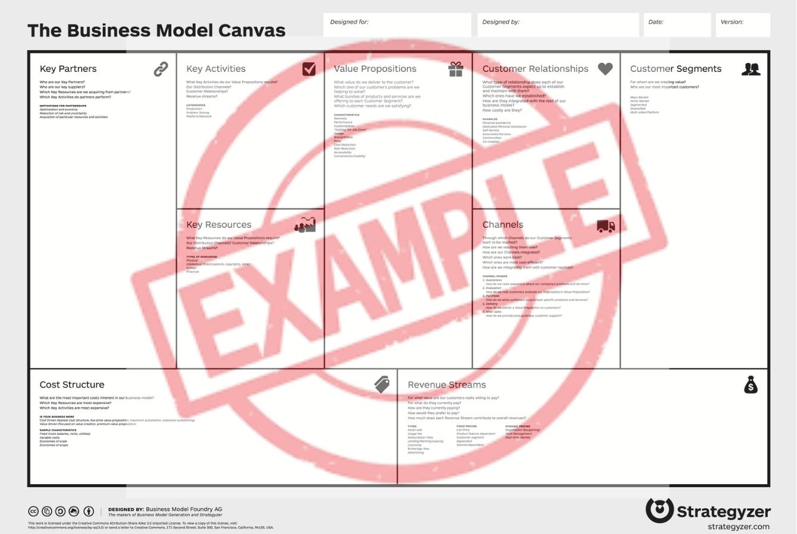

# Especificação do projeto

Pré-requisitos: <a href="01-Contexto.md"> Documentação de contexto</a>

Esta seção apresenta a definição do problema e a proposta de solução sob a perspectiva do usuário, utilizando técnicas de modelagem que permitam compreender e detalhar as necessidades do negócio e as funcionalidades esperadas do sistema.  

Nesta seção são apresentadas as personas, histórias de usuários, requisitos funcionais e não funcionais, bem como as restrições do projeto. Também são descritas as ferramentas e metodologias empregadas para elaborar essas especificações, garantindo que todos os participantes possuam uma compreensão unificada do escopo, dos objetivos e das prioridades do trabalho.

## Modelo de negócio (*Business Model Canvas*)

O *Business Model Canvas* (BMC) é uma ferramenta de planejamento estratégico que descreve, de forma visual e integrada, como uma organização cria, entrega e captura valor.  

No contexto deste projeto, o BMC auxilia no alinhamento da equipe em relação aos aspectos essenciais do negócio, servindo como base para decisões técnicas, de design e de priorização de funcionalidades.  

A seguir, apresenta-se um exemplo que deve ser adaptado pelo grupo de acordo com as características do projeto.  

> - O texto a seguir é apenas para orientação e deve ser apagado pelo grupo após a leitura.

O quadro é composto por nove blocos que representam as principais áreas de um modelo de negócio:
1. **Parceiros-chave**: identifique os parceiros estratégicos e descreva qual o papel de cada um no projeto.  
2. **Atividades-chave**: liste as atividades essenciais para a entrega da proposta de valor.  
3. **Proposta de valor**: explique por que os clientes escolheriam o produto/serviço, descrevendo o problema que ele resolve.  
4. **Relacionamento com clientes**: defina as estratégias para conquistar, manter e fidelizar clientes.  
5. **Segmentos de clientes**: caracterize os grupos de clientes que serão atendidos pela proposta de valor.  
6. **Recursos-chave**: descreva os recursos humanos, tecnológicos, físicos ou financeiros necessários para implementar a solução.  
7. **Canais de distribuição**: determine como a solução será disponibilizada e por quais meios o público-alvo será alcançado.  
8. **Estrutura de custos**: analise os custos envolvidos no desenvolvimento, operação e manutenção do negócio.  
9. **Fontes de receita**: indique como o negócio gerará receita, incluindo o modelo de monetização e a política de preços.  

> **Links úteis**:
> - [Quadro de modelo de negócios](https://pt.wikipedia.org/wiki/Quadro_de_modelo_de_neg%C3%B3cios)
> - [Business Model Canvas: como construir seu modelo de negócio?](https://digital.sebraers.com.br/blog/estrategia/business-model-canvas-como-construir-seu-modelo-de-negocio/)

## Personas

Exemplo: _Pedro Paulo tem 26 anos, é arquiteto recém-formado e autônomo. Pensa em se desenvolver profissionalmente por meio de um mestrado fora do país, pois adora viajar, é solteiro e sempre quis fazer um intercâmbio. Está buscando uma agência que o ajude a encontrar universidades na Europa que aceitem alunos estrangeiros._

Enumere e detalhe as personas da sua solução. Para tanto, baseie-se tanto nos documentos disponibilizados na disciplina e/ou nos seguintes links:

> **Links úteis**:
> - [Rock content](https://rockcontent.com/blog/personas/)
> - [Hotmart](https://blog.hotmart.com/pt-br/como-criar-persona-negocio/)
> - [O que é persona?](https://resultadosdigitais.com.br/blog/persona-o-que-e/)
> - [Persona x público-alvo](https://flammo.com.br/blog/persona-e-publico-alvo-qual-a-diferenca/)
> - [Mapa de empatia](https://resultadosdigitais.com.br/blog/mapa-da-empatia/)
> - [Mapa de stalkeholders](https://www.racecomunicacao.com.br/blog/como-fazer-o-mapeamento-de-stakeholders/)
>
Lembre-se que você deve ser enumerar e descrever precisamente e personalizada todos os clientes ideais que sua solução almeja.

## Histórias de usuários

Com base na análise das personas, foram identificadas as seguintes histórias de usuários:

|EU COMO... `PERSONA`| QUERO/PRECISO ... `FUNCIONALIDADE` |PARA ... `MOTIVO/VALOR`                 |
|--------------------|------------------------------------|----------------------------------------|
|Usuário do sistema  | Registrar minhas tarefas           | Não esquecer de fazê-las               |
|Administrador       | Alterar permissões                 | Permitir que possam administrar contas |

Apresente aqui as histórias de usuários que são relevantes para o projeto da sua solução. As histórias de usuários consistem em uma ferramenta poderosa para a compreensão e elicitação dos requisitos funcionais e não funcionais da sua aplicação. Se possível, agrupe as histórias de usuários por contexto, para facilitar consultas recorrentes a esta parte do documento.

> **Links úteis**:
> - [Histórias de usuários com exemplos e template](https://www.atlassian.com/br/agile/project-management/user-stories)
> - [Como escrever boas histórias de usuário (user stories)](https://medium.com/vertice/como-escrever-boas-users-stories-hist%C3%B3rias-de-usu%C3%A1rios-b29c75043fac)
> - [User stories: requisitos que humanos entendem](https://www.luiztools.com.br/post/user-stories-descricao-de-requisitos-que-humanos-entendem/)
> - [Histórias de usuários: mais exemplos](https://www.reqview.com/doc/user-stories-example.html)
> - [9 common user story mistakes](https://airfocus.com/blog/user-story-mistakes/)

## Requisitos

As tabelas a seguir apresentam os requisitos funcionais e não funcionais que detalham o escopo do projeto. Para determinar a prioridade dos requisitos, aplique uma técnica de priorização e detalhe como essa técnica foi aplicada.

### Requisitos funcionais

|ID    | Descrição do Requisito  | Prioridade |
|------|-----------------------------------------|----|
|RF-001| Permitir que o usuário cadastre tarefas | ALTA | 
|RF-002| Emitir um relatório de tarefas no mês   | MÉDIA |

### Requisitos não funcionais

|ID     | Descrição do Requisito  |Prioridade |
|-------|-------------------------|----|
|RNF-001| O sistema deve ser responsivo para rodar em dispositivos móveis | MÉDIA | 
|RNF-002| Deve processar as requisições do usuário em no máximo 3 segundos |  BAIXA | 

Com base nas histórias de usuários, enumere os requisitos da sua solução. Classifique esses requisitos em dois grupos:

- [Requisitos funcionais
 (RF)](https://pt.wikipedia.org/wiki/Requisito_funcional):
 correspondem a uma funcionalidade que deve estar presente na
  plataforma (ex: cadastro de usuário).
- [Requisitos não funcionais
  (RNF)](https://pt.wikipedia.org/wiki/Requisito_n%C3%A3o_funcional):
  correspondem a uma característica técnica, seja de usabilidade,
  desempenho, confiabilidade, segurança ou outro (ex: suporte a
  dispositivos iOS e Android).

Lembre-se de que cada requisito deve corresponder a uma e somente uma característica-alvo da sua solução. Além disso, certifique-se de que todos os aspectos capturados nas histórias de usuários foram cobertos.

> **Links úteis**:
> - [O que são requisitos funcionais e requisitos não funcionais?](https://codificar.com.br/requisitos-funcionais-nao-funcionais/)
> - [Entenda o que são requisitos de software, a diferença entre requisito funcional e não funcional, e como identificar e documentar cada um deles](https://analisederequisitos.com.br/requisitos-funcionais-e-requisitos-nao-funcionais-o-que-sao/)

## Restrições

Enumere as restrições à sua solução. Lembre-se de que as restrições geralmente limitam a solução candidata.

O projeto está restrito aos itens apresentados na tabela a seguir.

|ID| Restrição                                             |
|--|-------------------------------------------------------|
|001| O projeto deverá ser entregue até o final do semestre |
|002| O custo total do projeto não deve exceder o orçamento definido |
